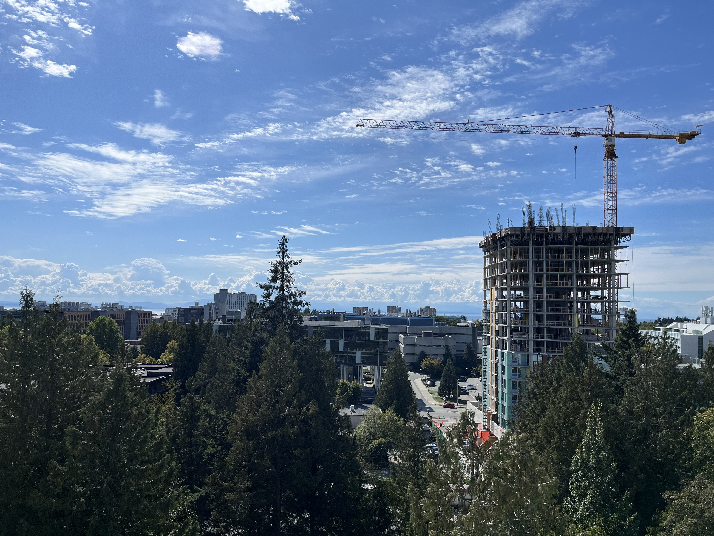
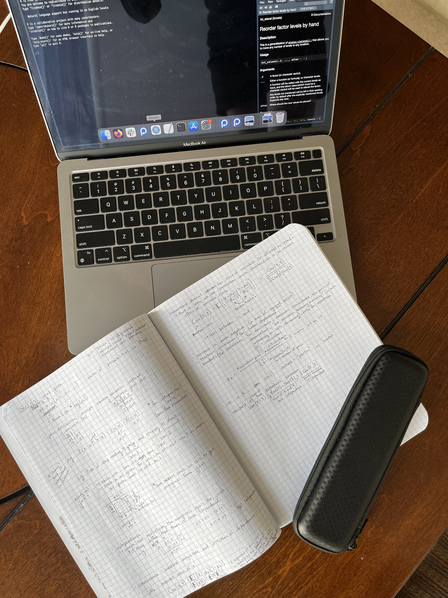

## Not getting lost
Vancouver is a new city for me so it has been nice to have some time to get oriented both to amenities in the city itself and to the UBC campus. The campus is walkable and provides convenient access to study space, a quick bit to eat, and the beach!

## Meeting my peers
During orientation, I had the chance to meet many of my peers who are coming from all sorts of different backgrounds to learn applications of data science that apply to their own work. The variety of experience is already supporting collaboration on assignments as there is always someone at the table who has more or less of an understanding of the given topic.

## Keeping things organized
Since it's been a while since school, it took some time to figure out how to keep on top of notes, studying, and assignments across many different platforms.

